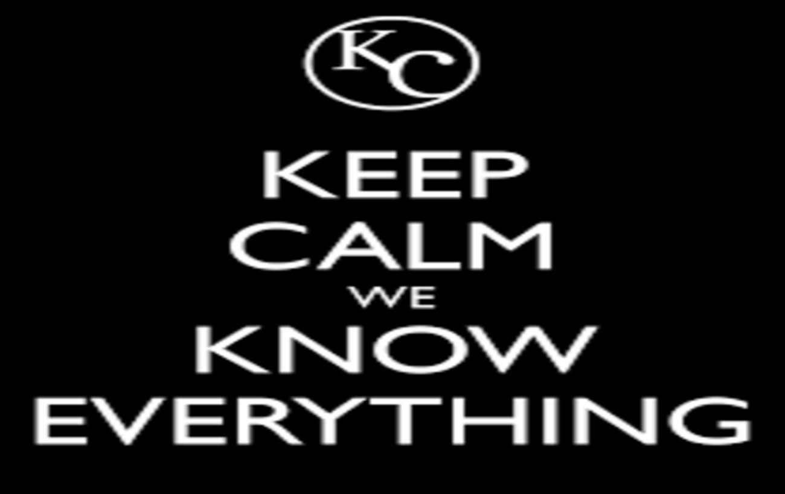
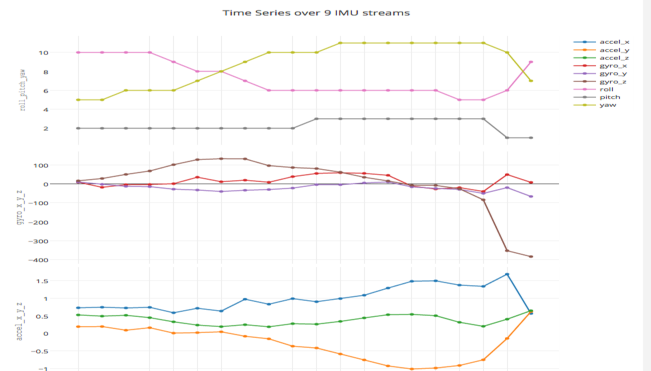
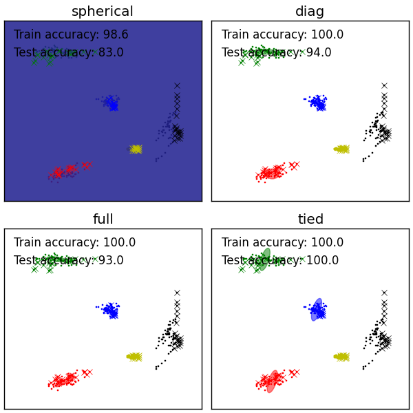

# LayeredSensing
* _Useing motion sensing and muscle electrical signals to detect user's daily activities in every second granularity_.
* _A plugin application to social networks or other mobile Apps to enhance user experice by high accuracy of complex activities recognition_.
* _Working on 1.shifting to cloud based application to be scalable to massive users. 2. Automatic (sensing) parameter calibration to reduce the training phase._

 |  |   
------|---|---
 Wearable devices | Myo armband | Mobile phone 

 |  |   
------|---|---
 Daily routine recognition |   **<--We sense everything -->** | Sports recognition

## Data Visaulization

### Install
 *Dependencies: matplotlib, ipython notebook, pandas, plotly.*

```
$ pip install matplotlib
$ pip install pandas
$ pip install ipython
$ pip install "ipython[notebook]"
```
Or you can install Anaconda, a full Python environment for scientific computing and data science, which includes above packages.
 1. Download and install Continuum’s [Anaconda](https://www.continuum.io/downloads).
 2. Update IPython to the current version using the Terminal:

```
$ conda update conda
$ conda update ipython ipython-notebook ipython-qtconsole
```

For real time data stream animation, you need to install Plotly:
```
$ pip install plotly
$ python -c "import plotly; plotly.tools.set_credentials_file(username='DemoAccount', api_key='lr1c37zw81')"
```
You'll need to setup an account of Plotly in order to run the python code.
 * [Plotly getting started](https://plot.ly/python/getting-started/).
 * [Tutorial](https://plot.ly/python/streaming-tutorial/).

After setup, please replace 'DemoAccount' and 'lr1c37zw81' with your Plotly username and [API key](https://plot.ly/settings/api/).


###### MYO API
src/data_stream_generation/myo_sensor_data.cpp will generate all the IMU data (motion activities, 9 data streams) and EMG data (muscle activities, 8 data streams) into 2 files, imu_data.csv and emg_data.csv in src/data/.

###### Realtime Visualization
You can run the imu_stream_disp.py and emg_stream_disp.py in src/data_stream_generation/ to visualize the data stream in real time while the above program is generating data. For example:

```
$ python imu_stream_disp.py ../data/imu_data.csv

$ python emg_stream_disp.py ../data/emg_data.csv
```
Example of 9 streams of IMU data:

###


## Activity Recognition
For more detail about the algorithm design and architecture, please read this paper [LayeredSensing](https://github.com/fairymane/LayeredSensing/blob/master/Paper_Slides/LayeredSensing.pdf)

#### Unit Pattern/Activity Recognition
Our unsupervised model GMM will detect new unit patterns that has not been learned yet and ask user if she/he want to train the new pattern 


Or when user want to train/recognize new daily activity.
```
$ python src/recognition/rain_new.py new_pattern_name/new_activity_name
```
name could be user-defined.


#### Real Time Recognition Mode
In this mode, the *LayeredSensing* would recognize the real time unit patterns in every 1 second and activities in every 4 seconds. The *LayeredSensing* would also remind user when new patterns are detected for training through user interaction.

```
$ python src/recognition/real_time_rec.py
```


## Team

[](https://github.com/) | [](https://github.com/) | [](https://github.com/)
---|---|---
[Tao Feng](https://github.com/fairymane) | [Zhiyuan Zheng](https://github.com/zhiyuanzheng) | [Wathid Assawasunthonnet](https://github.com/rockxja)

## License
 * MIT © [Tao Feng](https://github.com/fairymane)
 * [Myo SDK license agreement](https://github.com/fairymane/LayeredSensing/blob/master/LICENSE.txt)
